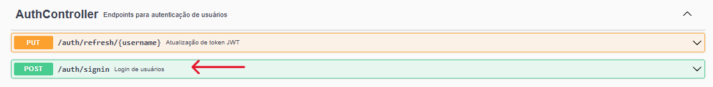
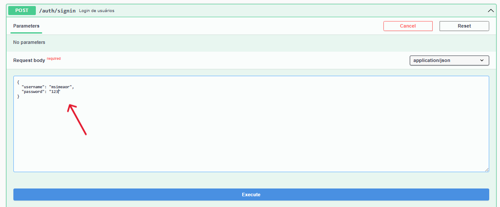
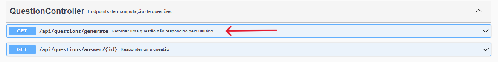
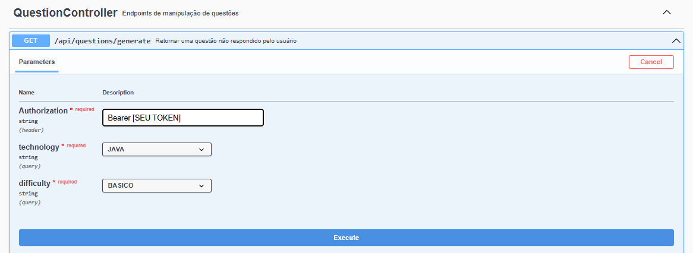
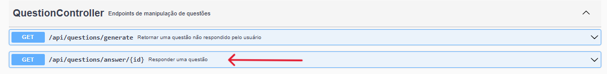
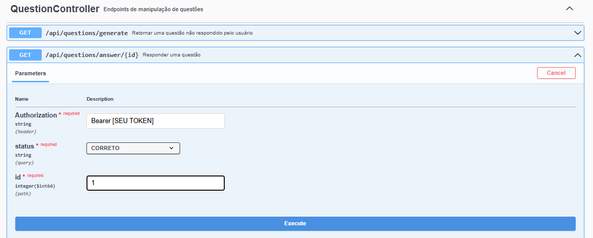

# 🚀 DevQuest API

[](https://openjdk.org/)
[](https://spring.io/projects/spring-boot)
[](https://www.docker.com/)
[](https://www.postgresql.org/)
[](https://openai.com/)

## 📝 Sobre o Projeto

A **DevQuest API** é o motor de back-end de uma plataforma de ensino gamificada voltada para a área de Tecnologia da Informação. A aplicação funciona como um provedor de recursos essenciais para potencializar o aprendizado técnico de desenvolvedores e estudantes de TI.

O grande diferencial tecnológico do projeto está na sua **integração nativa com a API da OpenAI (ChatGPT)**. Em vez de depender de um banco de dados estático e limitado com perguntas repetitivas, a DevQuest API utiliza inteligência artificial generativa para criar, sob demanda, questões teóricas e exercícios práticos de programação 100% personalizados, adaptando-se estritamente à **tecnologia** (ex: Java, React, SQL) e ao **nível de dificuldade** (ex: Iniciante, Intermediário, Avançado) selecionados pelo usuário.

### ⚙️ Principais Funcionalidades da API:

*   **Geração Dinâmica com IA:** Integração com LLM para gerar desafios de código e perguntas teóricas sob medida e em tempo real.
*   **Motor de Avaliação:** Recursos para submissão e registro de respostas de questões de múltipla escolha e resoluções de exercícios práticos.
*   **Histórico de Evolução:** Persistência e gerenciamento do progresso do usuário, mantendo um rastro detalhado de todas as questões e exercícios resolvidos para fins de métricas de aprendizado.
*   **Banco de Dados Relacional:** Modelagem robusta via PostgreSQL para garantir a consistência dos dados de usuários, trilhas de conhecimento e histórico de submissões.

## 🛠️ Tecnologias e Ferramentas Utilizadas

*   **Linguagem:** Java 21 (Instância gerenciada via Eclipse Temurin)
*   **Framework Principal:** Spring Boot 3.4.3
*   **Banco de Dados:** PostgreSQL
*   **Gerenciador de Dependências:** Maven
*   **Migrações de Banco:** Flyway / Hibernate
*   **Integrações:** OpenAI SDK (Spring AI / RestClient)
*   **Containerização:** Docker & Docker Compose (Build Multi-stage otimizado)

---

## 🏗️ Arquitetura e Boas Práticas

Para garantir a manutenibilidade, o projeto foi estruturado seguindo:
*   **Camadas Clássicas:** Controller, Service, Repository e DTOs (Garantindo o desacoplamento da API).
*   **Isolamento de Ambiente:** Uso rigoroso de variáveis de ambiente para dados sensíveis, garantindo que credenciais nunca sejam expostas no controle de versão.
*   **DevOps Ready:** Toda a esteira de build da aplicação foi automatizada em containers Docker, eliminando o problema do "na minha máquina funciona".

---

## ⚙️ Configuração das Variáveis de Ambiente (`.env`)

Nessa seção deixo o template do arquivo `.env`. Modifique os valores das variáveis com valores de sua preferência.

### Passo a Passo para Configuração:

1. Na raiz do projeto, crie um arquivo chamado `.env`.
2. Abra o arquivo `.env` e preencha-o seguindo o modelo interativo abaixo:

```env
# 🛡️ CONFIGURAÇÕES DE SEGURANÇA (JWT)
TOKEN_JWT_SECRETKEY=sua_chave_secreta_jwt_aqui
TOKEN_JWT_EXPIRELENGTH=360000

# 🐘 CREDENCIAIS DO BANCO DE DADOS (POSTGRESQL)
POSTGRES_USER=seu_usuario_do_banco
POSTGRES_PASSWORD=sua_senha_do_banco
POSTGRES_DB=devquest-db

# ☕ CONEXÃO DA API SPRING COM O BANCO
# ⚠️ ATENÇÃO: Mantenha o host como 'db' para a comunicação interna do Docker!
SPRING_DATASOURCE_URL=jdbc:postgresql://db:5432/devquest-db
SPRING_DATASOURCE_USERNAME=seu_usuario_do_banco
SPRING_DATASOURCE_PASSWORD=sua_senha_do_banco

# 🤖 INTEGRAÇÃO COM A INTELIGÊNCIA ARTIFICIAL (CHATGPT)
SPRING_AI_OPENAI_API_KEY=sua_chave_real_da_openai_aqui
```

---

## 🚀 Como Executar o Projeto com Docker (Passo a Passo)

Graças à containerização do projeto, **você não precisa ter o Java ou o PostgreSQL instalados na sua máquina**. O Docker cuidará de todo o processo de build e execução.

### Pré-requisitos
*   Possuir o [Docker](https://www.docker.com/products/docker-desktop/) instalado e rodando em sua máquina.
*   Uma chave de API da OpenAI (OpenAI API Key).
*   Modificar as variáveis do `.env` com valores de sua preferência

### 1. Clonar o Repositório
Abra o seu terminal e clone o projeto:
```bash
git clone https://github.com/msimeaor/backend-devquest.git
```

### 2. Buildar e Subir a Aplicação Completa
Com o Docker Desktop aberto e rodando em segundo plano, execute o único comando abaixo no seu terminal para que o Docker baixe as imagens, compile o projeto Java e inicialize todos os serviços:
```bash
docker compose up -d --build
```

---

## 🚀 Consumindo os Recursos da API

Com a API em execução, acesse a documentação Swagger no navegador:

```bash
http://localhost:8080/swagger-ui/index.html
```

A partir da interface do Swagger, siga o fluxo abaixo para autenticar, gerar uma questão e responder a questão gerada.


## 1. Realizar Login

No Swagger, localize o controller `AuthController` e execute o endpoint:

```http
POST /auth/signin
```


Utilize o seguinte body:

```json
{
  "username": "msimeaor",
  "password": "123"
}
```


Após executar a requisição, copie o token retornado na response.  
Ele será utilizado nas próximas chamadas da API.

## 2. Gerar uma Nova Questão

No controller `QuestionController`, execute o endpoint:

```http
GET /api/questions/generate
```


### Header Authorization

No header `Authorization`, informe o token retornado no login utilizando o seguinte formato:

```http
Authorization: Bearer SEU_TOKEN_AQUI
```

### Parâmetros

Nos campos:

- `technology`
- `difficulty`

Selecione qualquer uma das opções disponíveis nos selects.



Após executar a requisição, uma nova questão será gerada.

## 3. Responder a Questão Gerada

Ainda no `QuestionController`, execute o endpoint:

```http
GET /api/questions/answer/{id}
```


### Path Variable

Utilize:

```http
id = 1
```

### Header Authorization

Informe novamente o token JWT no header `Authorization`:

```http
Authorization: Bearer SEU_TOKEN_AQUI
```

### Parâmetro Status

No campo `status`, selecione qualquer uma das opções disponíveis.



Após executar a requisição, a questão será respondida com sucesso.

---

## Fluxo Completo

Seguindo os passos acima, o usuário conseguirá:

1. Autenticar na API
2. Gerar uma nova questão
3. Responder a questão gerada